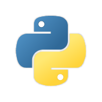
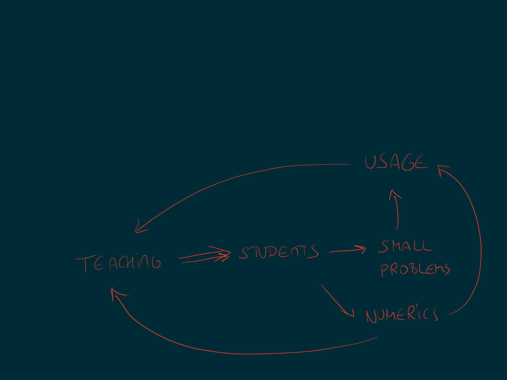

## **Commoditisation** and *programming languages*

#### Ruben Berenguel, *Lead Data Engineer*

---

^ Test footnote, hello!

---

# whoami

- Ruben Berenguel (@berenguel)
- PhD in Mathematics
- Lead data engineer using **Scala**, **Python** and **Go**
- Right now at **Hybrid Theory**

---

## **Commoditisation** and *programming languages*

^ You may be wondering what my approach to strategy can be, as a tech focused person. Last year, I had a mapping talk where I focused on technology landscape. It was a mapping talk with a twist: the map was not a Wardley map in the sense of having the usual x or y axes. Today I want to explore this a bit more together with you, by focusing on a recent question of mine. First, let me get us in the mood for mapping

---

^ [Marcel Duchamp's _Nude descending a staircase
n.2](https://en.wikipedia.org/wiki/File:Duchamp_-_Nude_Descending_a_Staircase.jpg)
and Pablo Picasso's [Girl with a
mandolin](https://en.wikipedia.org/wiki/List_of_Picasso_artworks_1901–1910):
[Cubism](https://en.wikipedia.org/wiki/Cubism#Interpretation) changed how
painting and observers saw reality, by showing different perspectives in one
image, or depicting time and space in different ways

---

^ [Reasons for bad
coffee](https://commons.wikimedia.org/wiki/File:Fishbone_BadCoffeeExample.jpg).
[Ishikawa](https://en.wikipedia.org/wiki/Ishikawa_diagram) diagrams allowed
people to analyse defects and reactions with ease

---

^ [A Higgs boson maybe
appears](https://commons.wikimedia.org/wiki/File:BosonFusion-Higgs.svg) Feynman
diagrams revolutionised theoretical particle physics

---

^ [Mendeleev's
original](https://commons.wikimedia.org/wiki/File:Periodic_table_by_Mendeleev,_1871.svg).
[The periodic
table](https://en.wikipedia.org/wiki/Periodic_table#Mendeleev's_table) organised
information in a way that highlighted what was unknown

---

[.autoscale: true]

> But there are also unknown unknowns — _the ones we don't know we don't know._ 
-- Donald Rumsfeld

^ The potential of finding new ways to represent what you know is exactly this:
realising what _you don't know_. Mendeleev's periodic table allowed him to
predict the properties of missing elements, such as gallium and germanium

---

# Wardley mapping

---

## What **happened** between...

---

^ Alderaan didn't shoot first

---

## and **this**

---

---

# ?[^1]

[^1]: And it's not the force

---

## It's actually this

---

---

## Having a __map__

# &

## Having a __plan__

^ Now we are ready to get into the meat of the issue

---

## Now that we are in a **mapping mood**, *what is the problem space* we want to analyse?

---

^ These are not the Wardley Maps you are thinking of. I think of Wardley Mapping as an overarching tool to explore problem spaces.
Join me to explore this one

---

## What are the 
### **landscape** and **climatic patterns** 
## of 
### *programming languages*?

^ My first question wasn't this one. I was pondering what the future relationship between 
Rust and Python may be, given Dropbox's rewrite of its core sync engine in Rust (from Python 2), 
and other rewrites and projects moving from Python to Rust (at least for the hot paths)

---

# This question is **too large**

---

#  Focus on **figuring the axes** first

^ This is in a sense a form of situational awareness. We have no bearings and we need to do with what we have

---

### What are the two *extreme* evolutionary stages of a **programming language**?

---

[.build-lists: true]

#### What are the two *extreme* evolutionary stages of a **programming language**?

1. **Just created**. A **toy**. An **experiment**. An **idea**.
2. *Used all over the stack*. *Not shiny* in a resumé.

^ We can imagine languages at stage 1 as when they started. Python started as the evolution of 
a teaching language. Haskell started as an investigation in lazy functional languages. Now, 
Python is used everywhere and **not shiny**. But, Haskell is *still* shiny

---

^ This is a possible view of how a language evolves from a "beginning" to an "end". These two languages started as an investigation of some concepts. Python, as the evolution of a simple language to make teaching easy. Haskell to explore some type-level ideas like laziness. Arguably, we could say the vertical axis represents "visibility to the user". At this _genesis_ stage teaching language would thus be more "visible" than one used in a specific corner of programming language research.

---

---

^ Jump to the present, and Python is probably one of the most "visible" programming languages, possibly only rivaled by Java. It is no longer in a teaching niche

---

^ It has expanded across most of the problem space, increasing visibility

---

^ But… Arguably, Haskell has expanded likewise. If we think of the vertical axis as how much of the problem space (ML, data, backend, frontend, etc) a language "takes", we can see a climatic pattern emerging: a language will expand until it covers all available space. What, then, distinguishes a "really" commoditised language vs another, not so commoditized?

---

## In a normal Wardley map we would call these two stages 

1. **Genesis**
2. **Commodity** (or utility)

## Are they?

^ We could argue for *Genesis*, although I prefer _Research Phase_ in this scenario. But what about 
commodity? To call something a commodity, we need to identify the user and see if there is really a
fully interchangeable source.

---

## Who is the **user**?

---

### *Option A:* The **company** choosing the language to use

---

### *Option B:* The **developer** choosing the language to learn

---

### *Option A:* The **company** choosing the language to use
### *Option B:* The **developer** choosing the language to learn

---

[.build-lists: true]

# *Option A*: **Company**

**Commodity** could mean:

- Access to a **large pool of talent** (*large market*)
- Access to a **varied pool of talent** (*range of skills*)

^ You could argue that the commodity in this case is the combination `developer+language`

---

[.build-lists: true]

# *Option B*: **Developer**

**Commodity** could mean:

- Usability across a **range of problems** (*generality*)
- Large individual **demand** (*ability to choose*)

^ You could argue that the commodity in this case is the combination `job+language`

---

# **Feedback loop** 
## or 
# **deadlock**?

^ A large pool of talent makes it more likely for a language to be picked by companies, 
and the more companies picking a language makes it easier for a language to be picked by 
individual developers. Let's see how this evolves by looking at a specific case

---

^ Let's have a look at Python, which was starting as a teaching language due to its simplicity

---

^ As students pick it up, they start using it for small problems (small tools, simple automation), usage increases

---

^ Eventually some students pick it up to simplify working with numerical analysis code. Usage increases again

---

^ More usage and more areas useful for teaching, means it's more used for teaching

---

^ Which means more students, more small problems solved, more usage. Eventually it starts being used for backend work, which again compounds on usage which increases the rest. A nice self-reinforcing feedback loop. Note that Java (with the additional push of by-committee creation) was also heavily used as a teaching language.

---

## As easy as that? *Teaching*?

^ This can't be the answer, though. Case in point, Lisp was used as a teaching language between the 70s and the 90s. And it didn't catch up, even if it was used mostly everywhere. Its failure can be chalked up to several reasons (lack of enough computing power, complex abstractions, bad connotations with the AI winter) but it still raises the question of what was the big difference. Likewise, Haskell is relatively used as a teaching language, and it clearly has not the same level of usage or exposure. Here, abstraction complexity may be to blame, and there is a possible answer in _simplicity_. How easy will be the next super mainstream language?

---

# **Open questions**

[.build-lists: true]

* What drives **programming language adoption feedback loops**, if it is not _teaching_?
* Are there any **other climatic patterns** to identify in the programming language landscape?
* How do programming languages **decay**?

---

# __Some Resources and interesting references__

* [S. Wardley, _Wardley Mapping Online Book_](https://medium.com/wardleymaps)
* [M. Nielsen, _Thought as a Technology_](http://cognitivemedium.com/tat/index.html)
* [D. Meadows, _Thinking in Systems_](https://www.amazon.com/Thinking-Systems-Donella-H-Meadows-ebook/dp/B005VSRFEA)
* [M. Lima, _Visual Complexity: Mapping Patterns of Information_](https://www.amazon.com/Visual-Complexity-Mapping-Patterns-Information/dp/1616892196/ref=pd_bxgy_2/145-1497482-8013630?_encoding=UTF8&pd_rd_i=1616892196&pd_rd_r=cff59bd4-8911-11e9-b65a-65ead2c4e194&pd_rd_w=wj9sw&pd_rd_wg=IpwOu&pf_rd_p=a2006322-0bc0-4db9-a08e-d168c18ce6f0&pf_rd_r=765AF27RCBSGE4HNNZDE&psc=1&refRID=765AF27RCBSGE4HNNZDE)
* [K. Iverson, _Notation as a Tool for Thought_](https://www.jsoftware.com/papers/tot.htm)

---

# Questions?

---

# __Thanks!__

---

Get the slides from my github:

`github.com/rberenguel/`

The repository is 

`commoditisation-languages`

---

# Further references

* [S. Wardley, _Playing Chess With Companies_ (OSCON 2017, on Safari Books Online)](https://www.oreilly.com/library/view/oscon-2017-/9781491976227/video306776.html)
* [S. Wardley, _Crossing the River by Feeling the Stones_](https://skillsmatter.com/skillscasts/13456-keynote-simon-wardley)
* [G. Adzic, _Skip the first three months of development for your next app_](https://www.youtube.com/watch?v=deHM34b21v4&app=desktop)

---

# EOF

